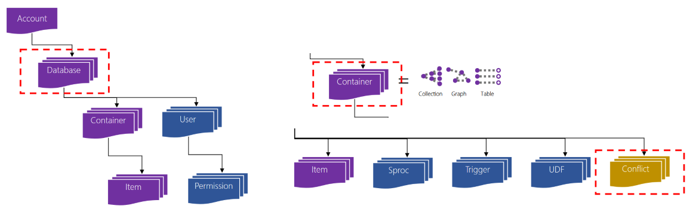

# Introduction to CosmosDb

(need images)

---

## What is CosmosDb

"A globally distributed, massively scalable, multi-model database service"

+++

## Globally distributed

* Multi-region (one or more write : multi-master, one or more read)
* Each region has many datacenters
* Data replicated in milliseconds between regions
  * PATCH behind the scenes
* Guaranteed low latency (SLAd)
* Regional Failover

+++

## Massively scalable

* Choose a partition key for your container
* All Items in a partition are co-located for speed
* CosmosDB automatically scales out partitions
* Configurable consistency
  * Eventual
  * Consistent Prefix (preserves order)
  * Session (user sees own writes)
  * Bounded Staleness (time-bound - anything older than x ms is consistent)
  * Strong (everyone sees the same)

+++

## Multi-model

* Multiple APIs
* Compatibility layers for:
  * Gremlin / GraphSON
  * Cassandra
  * MongoDb
  * Azure Table Storage

+++

## In development

Some use cases are production ready, with great documentation. Others less so.

---

## The Basics

* One account (_accountname_.document.azure.com)
* Many databases per account
* Many containers and users per database

+++

## The Basics



+++

## Containers

* Each container has:
  * Items
  * Stored procedures
  * Triggers
  * User-Defined Functions
  * Conflict (for colliding updates)
* Each API names these differently

+++

## SQL SDK Containers

SQL SDK is default - everything else is a defined schema on top

* container = `collection`
* Item = `document`

+++

## Lifecycles

* Use TTL to expire documents without consuming RUs
* TTL (Time to Live) :
  * -1 = Off (infinite life)
  * *n* = delete *n* seconds after last update
* Can be set at collection level (default for all documents), and document level to overwrite this
* Set TTL to *null* on a document to use default

---

## The APIs

* SQL (LINQ over JSON, fka DocumentDb)
  * Database of Collections of Documents
* Table (Key-Value) - mostly compatible with Azure Table
  * Database of Tables, with Rows
* Graph API (using the Gremlin graph traversal language)
  * Database of Graphs with Edges and Vertices
* MongoDb
* Cassandra

Note:

Think of DocumentDb as 1.0, CosmosDb as 2.0, but what you really want is 2.1 Not really interested in MongoDb and Cassandra in this talk - think of it as IaaS for those APIs.

+++

## Data structure (SQL API)

* It's not relational, it's roughly hierarchical, but you can layer inter-document links
* Don't try and join between documents, you can only join within to traverse hierarchy
  * Query across common keys then project into the result
* What queries do you need to optimise?
  * Fit the structure round the common problems
  * Are you optimising for read or write?
  * Remember you can store multiple projections
* It's no longer about 3NF
  * Remember the SQL API is SQL syntax on NoSql data

+++

## Data structure (Table API)

* It's actually KV pair
* Flat documents (no nesting)
* Simplified SQL API
* Designed to upgrade from Azure Table storage with no rework
* CosmosDb advantage and guarantees, but new projects probably better with SQL API
* PartitionKey and RowKey (id) are required

+++

## Data structure (Graph API)

* Nodes and vertices
* Models relationships (e.g. social media)
* Supports Gremlin language for data manipulation and queries
* Flat data, modelled within SQL API
* Can use SQL API to add additional data to graph collection
  * e.g. \_graph\_icon\_... to display pictures in graph explorer on Azure portal


+++

## Using the SQL API in C#

* Some client set-up then...

```cs
IDocumentQuery<dynamic> query = client.CreateDocumentQuery(
    UriFactory.CreateDocumentCollectionUri(DatabaseName, CollectionName), 
    "SELECT * FROM c WHERE c.city = 'Seattle'", 
    new FeedOptions 
    { 
        PopulateQueryMetrics = true, 
        MaxItemCount = -1, 
        MaxDegreeOfParallelism = -1, 
        EnableCrossPartitionQuery = true 
    }).AsDocumentQuery();

FeedResponse<dynamic> result = await query.ExecuteNextAsync();

```

---

## Failover

* Automatic
  * Write region priority order
  * Missing writes turn up in Conflicts
* Manual
  * Follow the Clock if users are worldwide
* `PreferredLocations` in configuration
* All regions map to single URL (`multi-hosting`)

---

## Consistency Levels


---

## Performance tuning

* Use metrics to explore
* Index and partition
* Prefer smaller operation (PUT over POST/DELETE over bulk)
* Use TTL to expire
* Use change feed to offload processing, add additional partitions

+++

## Indexing

* Index all the things automatically
* No need for schema and index management
* Hash, range, and geospatial indexes
  * Hash for equality, range for ordering, geospatial for location
* ...but sometimes you need to tune
* Top searches should be on id or partition key for best results

+++

## Scaling

* Scale up = add RUs (increase `Throughput`)
* Scale out = Partitioning
* Expect HTTP 429 if you exceed RU limit
* SDK has auto-retry, so only worry if it's common

+++

## Partitioning


+++

## Dynamic Partitioning


+++

## Partitioning

* Automatically partitioned
* Choose a key that adequately distribute the data
* CosmosDb will automatically cluster
* Multiple partitions in one partition range
* Timestamp likely a bad idea - likely to cluster
* Optimise for read or for write

+++

## Choosing Partition strategy

* Add more partition keys to give CosmosDb more scaling options
  * Create compositite key
  * OR use change feed for multiple partition strategies
* Review metrics to see where to partition
* 100 RU/s minimum for non-partitioned storage, 1000 RU/s for partitioned storage
* Need to migrate to move from Fixed to unlimited

+++

## Scaling to large documents

* Offload to Blob storage
* Disable indexing on most properties
* Append partition key to split large collections

+++

## Query performance

* cross-partition queries disabled by default
* page size as in SQL `MaxItemCount`
* Use `PopulateQueryMetrics` to gather statistics

---

## The change feed

Every change that happens to the data is published in a feed that you can subscribe to via Azure Functions or other hooks.


+++

## Projecting data

You can use the change feed to aggregate or otherwise transform data, so that you can have one collection optimised for writes and another optimised for reporting, updated in near-real-time.

---

## meta properties

* *_rid* immutable record id
* *_self* link (use CreateDocumentUri if needed)
* *_etag* for concurrency
  * concurrency is opt-in, record the etag on retrieval then send with the update request to check for changes
  * otherwise use Conflict container to resolve afterwards, if you wish to
* *_attachments* append to _self for list of attachments
* *_ts* last updated timestamp in epoch time

---

## JS in the database?

* Good use of internal processing can reduce your RU count, and therefore costs
* Stored procedures
  * Full SDK access
  * Useful for validation and other pre-update processing
* UDF
  * Functions called within queries
  * Can accept and return any JSON object
* Triggers
  * Azure Functions  
* Not TypeScript

---

## New considerations

* RUs?
  * A measure of computational complexity. Can be hard to predict. So build, test, and measure. Pricing is based on allocating enough resources for x00 RUs.
* Tuneable consistency
  * (new slide with image on this)
  
---

## Local development

* CosmosDb emulator (and limitations)
  * Only SQL and Table API (is this still true?)
  * Does not support any consistency model (so only single-threading for dev)
  * Does support UDF and SPs (is this still true?)
  
+++

## C♯

* Creating models
* LINQ and conventions
  * Silent failures
* Automapping is very nice, when it works

---

## Integration with Azure Fuctions

* Change feed - just the updates, ordered by _ts timestamp
* Trigger by database + collection
* Get full data for each document

---

## Integration with Azure Search

* Natural language (plurals, tenses etc)
* CosmosDB is persistence layer
* Use @HighWaterMark as last updated reference
* Search cannot track hard deletes
  * Use soft deletes with TTL

---

## Integration with Spark

* Use CosmosDB for real-time data
* Use Spark for analysis
* Historical or real-time predictions
* Pushdown Predicate Filtering : subsets of data based on indexes
* Alternative to Gremlin - decide what's best for you

+++

## Getting data into Spark

* pyDocumentDb OK for small data sets (effectively SELECT *)
* Spark integration better as that allows parallelisaton
* Can use changefeed for real-time integration
* Refresh to see updates

---

## Data migration

* `azcopy`
* Data Migration tool (desktop and CLI)
* Azure Data Factory (import from CSV etc. within portal)
* Special rules for MongoDb `vvv`

+++

## MongoDb

* Import data
* New connection string
* Shard using `{ shardCollection: "admin.people", key: {region: "hashed"} }` or similar
* Use `db.runCommand({getLastRequestStatistics: 1})` to see RUs required to insert a record
* Use `setVerboseShell(true)` to record latency statistics

+++

## MongoDb *batchSize*

* For _batchSize_, divide the total provisioned RUs by the RUs consumed from your single document write.
* If the calculated _batchSize_ <= 24, use that number as your _batchSize_ value.
* If the calculated _batchSize_ > 24, set the _batchSize_ value to 24.
* For _numInsertionWorkers_, use this equation: _numInsertionWorkers_ = (provisioned throughput * latency in seconds) / (batch size * consumed RUs for a single write).

---

## Example

Room booking system

* Number of sites
* Each site has multiple employees
* Each site has multiple rooms
* Each room can have multiple events
- OR -
* Events have their own collection
* Each event has a start and end time (fun with timezones)
* Each event has a title
* Each event has an attendee list
* Each event may have on-line details

---

## Gotchas

* have to opt in to detect conflicts (etag) - sometimes this is ok
* Emulator doesn't support consistency
* Case matters

---

## Conclusion

---

## Questions?
  
